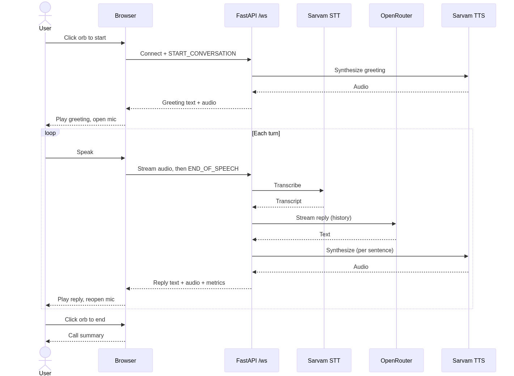

# Sahaara — Voice Healthcare Aid Assistant

A real-time, voice-first health companion. Talk to it like you'd talk to a calm,
experienced nurse: describe your symptoms or ask a general health question, and
Sahaara replies out loud — reassuring you about the small stuff, flagging what
actually needs a doctor, and escalating clearly in an emergency.

> ⚠️ Sahaara is not a doctor. It doesn't diagnose or prescribe. For emergencies,
> call **108** or **112**, or go to the nearest ER.

## What it does

- **Speak, don't type.** Click the orb and have a natural back-and-forth — voice
  in, voice out. Silence detection ends your turn automatically.
- **Sensible triage.** Calm, plain-language guidance: self-care for minor things,
  a clear "see a doctor, and here's why" when it's warranted, and immediate
  escalation for red-flag symptoms (chest pain, stroke signs) or crisis support.
- **Low latency by design.** The reply is streamed as a pipeline — the LLM's
  first sentence is synthesized and starts playing while the rest is still being
  generated, so you hear an answer fast. Per-turn STT / LLM / TTS latencies are
  shown live and summarized at the end of the call.

## How it works

Browser captures mic audio over a WebSocket; the FastAPI backend orchestrates
speech-to-text, the LLM, and text-to-speech, streaming audio back as it's ready.



See [`docs/sequence-diagram.md`](docs/sequence-diagram.md) for the detailed flow,
including the streaming pipeline and turn-handoff nuances.

## Stack

| Layer    | Choice                                            |
| -------- | ------------------------------------------------- |
| Backend  | FastAPI + WebSockets (no voice framework)         |
| Frontend | Single static page — Web Audio API, MediaRecorder |
| STT      | Sarvam `saaras:v3`                                |
| LLM      | OpenRouter (model configurable)                   |
| TTS      | Sarvam `bulbul:v3`                                |

## Quickstart

```bash
# 1. Install
pip install -r requirements.txt

# 2. Configure — copy and fill in your keys
cp .env.example .env

# 3. Run
uvicorn main:app --reload
```

Open <http://localhost:8000> and click the orb to start talking.

### Environment

| Variable             | Description                                |
| -------------------- | ------------------------------------------ |
| `SARVAM_API_KEY`     | Sarvam AI key (used for both STT and TTS)  |
| `OPENROUTER_API_KEY` | OpenRouter API key                         |
| `OPENROUTER_MODEL`   | Chat model, e.g. `openai/gpt-4o-mini`      |
