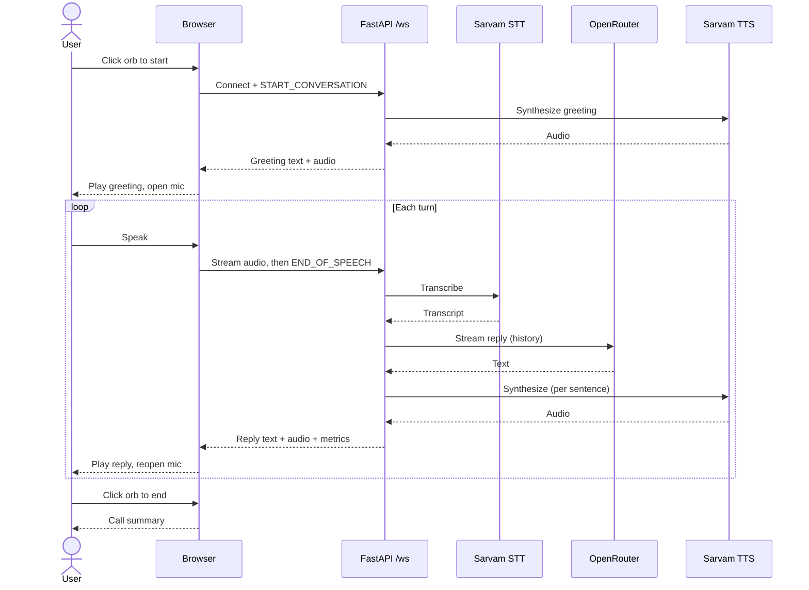

# Sahaara — Voice Assistant Sequence Diagram

End-to-end flow of a voice conversation, from clicking the orb through each
spoken turn. Entry points: `startConversation()` in `static/index.html` (browser
side) and `websocket_endpoint` in `main.py` (server side).

Mermaid source (renders on GitHub / Mermaid-capable viewers)

## Notes

This is a simplified view. Two details collapsed in the diagram but worth knowing:

- **Streaming overlap:** the LLM→TTS→Browser steps actually run as a pipeline,
  not in sequence. `stream_response_and_audio` (`main.py`) splits the LLM stream
  into sentences and synthesizes each one as it's ready, so the user hears the
  start of the reply while the LLM is still generating the rest.
- **Turn handoff:** the browser only reopens the mic once the server's `TURN_END`
  marker has arrived *and* all queued audio has finished playing
  (`maybeFinishTurn` in `index.html`).
